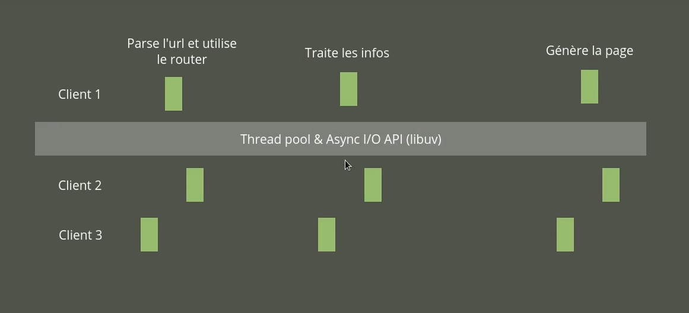
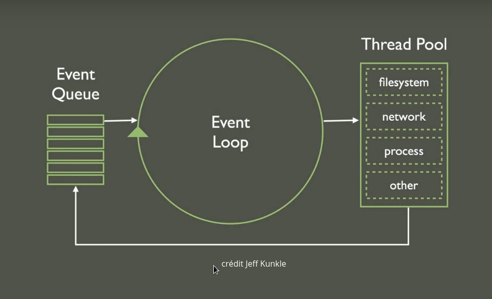
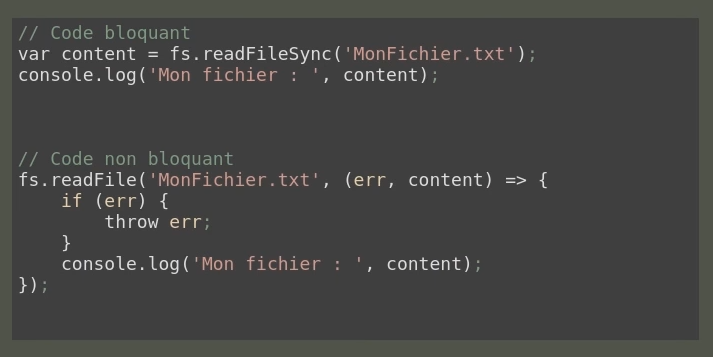
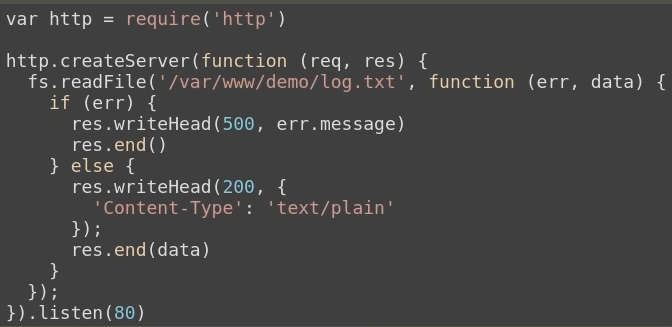
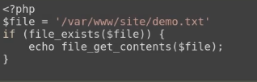
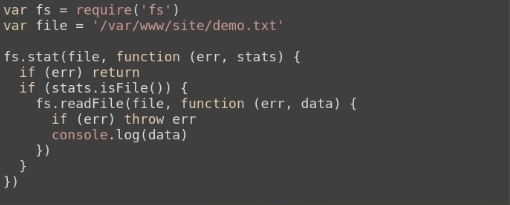

## Node.Js

Et bien pour commencer il faut savoir que **NodeJs** n'est pas un framwork web.

il ne permet pas de crée une page web très rapidement. C'est une technologie qui vous permet d'exécuté du **Javascript** coter serveur afin d'effecteur différente opération. Ca se présente comme un "nouveau" langage qui vas vous permettre d'interagir avec votre système au même titre que  Ruby, Python, etc.

## Pourquoi NodeJs

Pour cela il faut tout d’abord comprendre la problématique **NodeJs**

* Sur un script standard nous passons le plus claire de notre temps a attendre des réponse au niveau écriture/lecture des fichier.

ici dessous vous observerer le deroulement d'un script **Javascript**.

* Quand nous arrivons sur la page notre **script** va parse l'url et rediriger vers les bonne action a effectuer.

* En fonction des ses action il va faire des demande a la base de donnée, et attendre le résultat.

* Lorsqu’il aura les résultats il effectuera d'autre opération.

* Et enfin il pourra générer la page selon les informations reçue

Dans notre **script** les temps d'execution est assez court mais passer plus de temps a attendre les informations depuis une base de donnée ou des fichier, au final le temps d'execution de notre script est plus long a cause de ses phase "morte"(invisible)

**Le principe de Node.js** est de séparer tous ça, c'est a dire séparer la partie script qui est celui que vous avez réaliser de la partie qui demande les accès au fichier.

* Dans ce cas si, quand nous arrivons sur la page il pratique la même opération, parse l'url et redirige les actions a réaliser.

* Ensuite on va lui dire que nous avons besoin de récupérer des informations dans la base de donnée. Mais pour les récupérer nous allons utiliser une **Thread pool**

* Du coup notre script est arrêter et la demande est gérer de manière __Async__. Dans ce cas il sera capable de traiter une seconde requête (ex: quelqu’un arrive sur votre page dans le même intervalle)

* Une fois les donnée récupérer il va relancer le script et traiter les données reçue, si il a besoin d'autre information il refera appel a la **Thread pool**.

* Et enfin il générera la page.

L'avantage est que nous seront gérer beaucoup plus de concurrence par rapport a un script bloquant.

## Comment ça fonctionne ?

* Lorsque nous écrivons notre script il va déclencher une **Event Queu**, il va prendre la première opération effectuer.
* il va l'effectuer si il peut, dans le cas contraire il l'enverrai au **Thread pool**, qui vas ce charger lui de réaliser des actions plus complexe (ex: accéder a un fichier, outil réseau,etc)
* Une fois l'opération terminer, il exécute la suite du code et rajoute le code a exécuter dans **Event Queu**

   

## Du code !

Tout d'abord il faut comprend la notion de code __bloquant__ et le code __non bloquant__.

* code __bloquant__ => c'est un code écrit de manière **synchrone** dans l'image si dessus pour prend un exemple. Le code procédera de cette façon => "je crée une variable 'content'" et je veux que tu lise le contenu du fichier indiquer, la ligne suivante sera exécuté une fois la ligne précédent terminer. Le probleme c'est que on exploite pas dutout le systeme de boucle d'evenement et le coter Async de NodeJs

La manière la plus propre d'ecrire NodeJs est la suivante __non bloquant__

* Code __non-bloquant__ => C'est un code écrit de manière **Asynchrone** dans l'image si dessus pour prend un exemple. On lui demande de realiser une lecture du fichier et lorsque tu as lu le fichier, tu realisera le code demander, mais si il y a du code un peu plus bas il pourrat l'executer en attendant que la lecture du fichier (dans ce cas ci) soit terminer et qu'il realise la commande

(ex: vous avez 12 fichier a lire, un fois terminer il l'affichera independament. Contrairement a un code bloquant qui risque de mettre ennormement de temps si vous avez un disque que est plus lent pour la lecture)

## Ca fonctionne comment ?

C'est un langage bas niveau.

Expliquons nous, si nous voulons crée un serveur web qui vat écouter une requête et realiser une ou plusierurs opération en fonction, il faudrat tout taper. Mais ne stresser pas tout de suite !

Voici un aperçu

Vous ne comprennez pas trop ? pas de soucis je vous explique tout de suite !

Dans cette image nous fesont un appel **HTTP** qui est un module de NodeJs on lui dis de crée un serveur qu'il ecoutera sur le port 80 et lorsque le serveur est dispo tu vas lancer la fonction.

Cette fonction prend 2parametre **requete** et **reponse** (req,res), il réalisera ensuite les fonction/condition demander.

Avec NodeJS nous allons érire beaucoup de code avec se systeme de **callback**, nous aurons donc pas mal d'imbrication dans notre code mais pas de  stresse il y a des librairies ;-)

## Inconvénient

Si nous voulons profiter des performance et des optimisations de NodeJs on vat pas écrire de manière logique. Mais si on a l'habitude du code synchrone ca prendra 3 lignes.

Dans le cas d'un code Asynchrone c'est un peu plus complexe.

* je demande des informations sur le fichier

* si je recoitles infos je lis le fichier

* si...
(on imbrique de plus en plus)

On constate que pour une même opération ca vat être un peu plus long, c'est un coup pour profiter des avantages.

### Single Thread

Si vous demander des calcules qui demande pas mal de resource au processeur vous risquer de __bloquer__ votre **thread**, et vous ne pourrez pas gérer d'autre requête ou demande qui entre.

Sa ne veut pas dire que nous sommes limiter on a la possibilité de faire des **child** qui pourront traiter les calcules plus lourd. Ca permet d'optimiser le code et évite la gestion **Multi-Threading**.

### Bas niveau

Comparer a **PHP**, qui nous offre pas mal de preconception afin de pouvoir l'utiliser, NodeJs a par default tres peu de choses ducoup on vat devoir écrire pas mal de choses qui sont implémenter ailleurs.

## Avantage

Bien plus performant si nous avons beaucoup d'cces système a réalise, notre script vas pouvoire faire bien plus de traitement simultané par rapport a un script bloquant.

### Multi-Platform

Il fonctionne sur tout les systeme d'exploitation sans aucun soucis.

* Linux

* Mac

* Windows

### Un seul langage

Ca évite de devoir faire des conversion de notre script (comme quand on utilise php par exemple). La on a un seul langage pour fonctionner sur tout les système.

Mais aussi nous pourrons partager des librairies, si vous crée une grosse librairie pour réaliser des opération particulière vous pourrez l'utiliser a la fois coter serveur et aussi coter navigateur. C'est cool vous trouvez pas ?

### Facile a apprendre 

C'est un peu relatif car on vat devoir apprendre des choses un peu plus pousser suite a sont bas niveau. Mais de manière général si vous connaisser déjà **Javascript** vous serez donc habituer avec la methode Asynchrone.

Même si NodeJs apporte une logique de develloppement **Backend** différente, sa ne vous sera pas une logique inconue :-) . 

### NPM

Par default NodeJs possède un gestionnaire de packet. Comme **composeur** pour PHP ou **Rubygem** pur Ruby, le gestionnaire de packet vat pouvoire installer de manière rapide n'importe quoi.

Autre particularité, NodeJs possède une tres grande communauté qui partage différente librairie, vu que c'est présent depuis longtemps nous possédont donc pas mal de librairie.