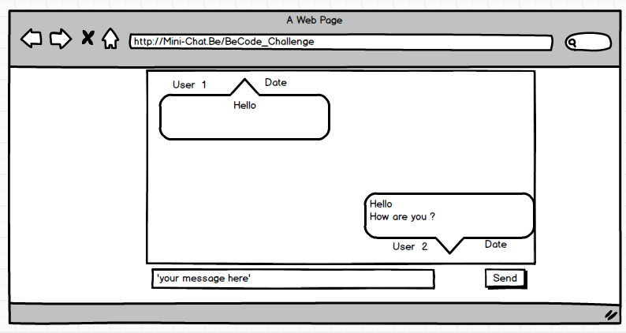

# Chat
Challenge BeCode "create a mini-chat"

## Information NodeJs

[Aboute Node](./NodeJs.md)
[Install Node](./InstalleNode.md)

## Objectif

We do a standar chat we have created a balsamique view 

## Technologies Used

- NodeJs
- MySQL